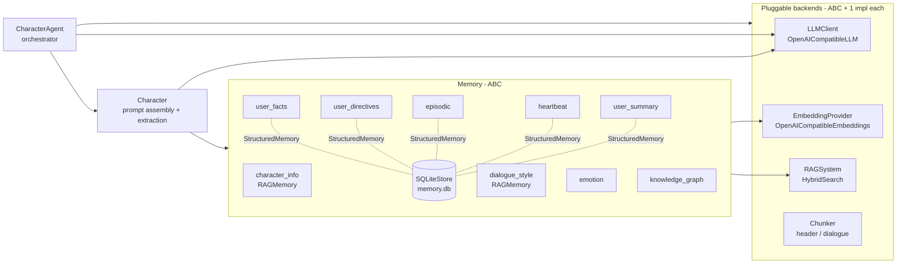

# Architecture

The whole system is a set of **abstract base classes, each with one reference
implementation**. The `CharacterAgent` orchestrates everything and is the only
object most callers touch. Swapping any one piece (LLM, embeddings, retrieval,
chunking, a memory, a tool) is a single new subclass; nothing else changes.



## Per-turn data flow

For every `generate_answer(target, …)` call (`agent.py`):

1. **Resolve the target.** A `Chat`, a chat id, a raw query string, or a bare
   OpenAI-style message list, all normalised to
   `(last_user_msg, user_id, prior_messages, participants)`. Participants come
   from a persisted `Chat` (every human speaker in it); raw queries are
   single-user.
2. **Build a history-aware retrieval query.** The last
   `retrieval_history_window` user messages each become a weighted query
   (`weight = retrieval_recency_decay ** i`, most-recent first). The memories
   fuse them with weight-scaled RRF. `window=1` reproduces the single-query
   legacy path bit-for-bit.
3. **Recall.** For each enabled memory, `recall(query, user_id, limit)` runs.
   `PER_USER` memories recall once per participant; `CHARACTER` memories recall
   once. See [Memory systems](memories/index.md).
4. **Select and assemble the prompt.** An optional [global budget/reranker](memory_budget.md)
   selects whole items across retrieved memories. Candidates are retrieved
   read-only on this path and only selected items receive reinforcement.
   `Character.render_prompt` interpolates the system
   template, then appends every rendered memory section in `section_order`.
   Empty sections are omitted.
5. **Call the LLM.** With `tools=None` → a single `chat` / `chat_stream` call.
   With tools → the model↔tool loop runs (see [Tools](tools.md)).
6. **Persist the assistant reply.** Only the **final text** is written to the
   `messages` table; intermediate tool-call / tool-result messages stay
   in-memory for the loop and are never persisted.
7. **Learn.** Every `extract_interval` user turns the extractor runs over the
   unprocessed messages: one LLM call produces facts/directives/episodes/
   emotion deltas/user summaries, each memory consumes its slice, then
   dedup + knowledge-graph updates run. Idempotent and resumable thanks to the
   `extracted` flag on every message row.

## The extension seams

Every seam below is an abstract base class with one bundled implementation.
Pass a custom one in via `CharacterAgent(...)` / `generate_answer(...)`.

| Seam | ABC | Reference impl | How to swap |
|---|---|---|---|
| LLM | `llm/LLMClient` | `OpenAICompatibleLLM` | `CharacterAgent(llm=…)` |
| Embeddings | `llm/EmbeddingProvider` | `OpenAICompatibleEmbeddings` | `CharacterAgent(embedder=…)` |
| Retrieval | `rag/RAGSystem` | `HybridSearch` | pass into any memory |
| Chunking | `chunking/Chunker` + `registry.py` | `header`, `dialogue` | `ChunkingConfig.info_chunker` |
| Memory | `memories/Memory` | 9 built-ins | `CharacterAgent.load(llm, embedder, memories=…)` |
| Tool | `tools/base.Tool` + `@tool` | memory self-tools | `generate_answer(tools=…)` |

## Two DRY bases that must not be bypassed

1. **`StructuredMemory`** (`memories/structured.py`) — shared by
   `UserFactMemory`, `UserDirectiveMemory`, `EpisodicMemory`,
   `HeartbeatJournal`, `UserSummaryMemory`. It owns the SQLite row ↔ RAG index
   ↔ decay wiring. Subclasses only declare `table` / `extra_columns` /
   `text_column` and implement `row_text` / `row_item`. **Never reimplement
   `recall` / `add` in a subclass.**
2. **`HybridSearch`** (`rag/hybrid.py`) — one RAG impl reused by the two
   RAG memories *and* the four structured memories (for BM25+similarity recall
   over their rows). New RAG backends subclass `RAGSystem`; memories don't
   care which they get.

## Persistence layout

All state lives in one directory per character:
`<character_dir>/<config.data_dir>` (default `.cm_data`).

```
.cm_data/
├── memory.db                  # ONE SQLiteStore, one table per structured memory + chats/messages
├── info_index/                # RAG index for character_info
│   ├── nodes.json             # text + metadata — the source of truth
│   └── faiss.index            # dense vectors
├── dialogue_index/            # RAG index for dialogue_style
├── user_facts_index/          # one RAG index per structured memory
├── user_directives_index/     # (rebuilt from SQLite rows if the dir is missing)
├── episodic_index/
├── heartbeat_index/
├── user_summary_index/
└── kg_index/                  # optional knowledge-graph persistence
```

- **One SQLite connection** backs every structured memory and the chat tables.
- Each RAG-backed memory has its own `<name>_index/` folder holding
  `nodes.json` (text + metadata — source of truth), `faiss.index`, and
  `index_meta.json` (embedding compatibility fingerprint).
  BM25 is rebuilt in-memory from `nodes.json` at load (not persisted).
- Structured-memory RAG indexes are rebuilt from SQLite rows if the index dir
  is missing, or if an empty node snapshot conflicts with a non-empty table.
- **Wiping `.cm_data` resets the character.** Deleting only `memory.db` keeps
  the knowledge indexes (`info_index`, `dialogue_index`) but clears all learned
  memory and chat history.

`HybridSearch.persist` writes the node, vector, and metadata files via
temporary files + `os.replace` under an
exclusive `flock` on `<path>/.lock`, so the server and a separate process (the
Discord bot, the CLI) can persist the same index concurrently without torn
writes.

## Multi-user / group chats

A single chat can host **several human speakers**. Each `messages` row carries
the `user_id` of its speaker; memories are extracted **per speaker**, and when
answering the prompt recalls for **all participants**.

- **Per-memory scope declaration** — `Memory.scope` is either `PER_USER`
  (recall once per participant: facts / directives / episodic / emotion /
  summary) or `CHARACTER` (recall once: wiki / dialogues / heartbeat / KG
  self-baseline). The orchestrator fans recall out accordingly.
- **Single-user is unchanged** — a 1:1 chat has one participant, so every
  recall/render/extract path collapses to the legacy single-user path.

See [Multi-user](multi_user.md) for the full design.

## Tool / function calling

The character can invoke **tools** (LLM function-calling) during generation.
This is a *separate seam* from the MCP server's tools: here the **model
itself** calls tools mid-turn.

- `generate_answer(tools=…)` runs the model → tool → model loop.
- `tools=None` is the legacy single-shot path, bit-for-bit unchanged.
- Built-in read-only **memory self-tools** via `agent.memory_tools()`.
- **Only the final assistant text is persisted** — intermediate tool-call /
  tool-result messages stay in-memory, so chat history and extraction stay
  clean.

See [Tools](tools.md).

## Key files

| File | What's in it |
|---|---|
| `agent.py` | `CharacterAgent` — orchestrator, tool loop, extraction scheduling |
| `character.py` | `Character` — prompt assembly + extraction driver |
| `chat.py` | `Chat` / `_ChatBackend` — persistent conversations, participants |
| `config.py` | Every tunable: models, endpoints, toggles, decay, k-values |
| `character_config.py` | The per-character `config.yaml` loader/saver |
| `prompts.py` | Every prompt template (`PromptConfig`) |
| `memories/` | The `Memory` ABC + 9 memory implementations |
| `memory/structured.py` | The shared `StructuredMemory` base |
| `memory/decay.py` | creation-age decay + bounded 10% exposure familiarity + 110% relevance repair |
| `rag/hybrid.py` | `HybridSearch` — BM25 + FAISS, RRF-fused |
| `llm/base.py` | `LLMClient` / `LLMResponse` / tool-calling methods |
| `tools/` | `Tool` ABC, `@tool`, `ToolRegistry`, memory self-tools |
| `knowledge_graph/` | Spreading-activation retriever (see [Knowledge graph](knowledge_graph.md)) |
| `server/` | Optional FastAPI app: `/context`, `/save`, `/extract`, `/gui`, `/mcp` |
