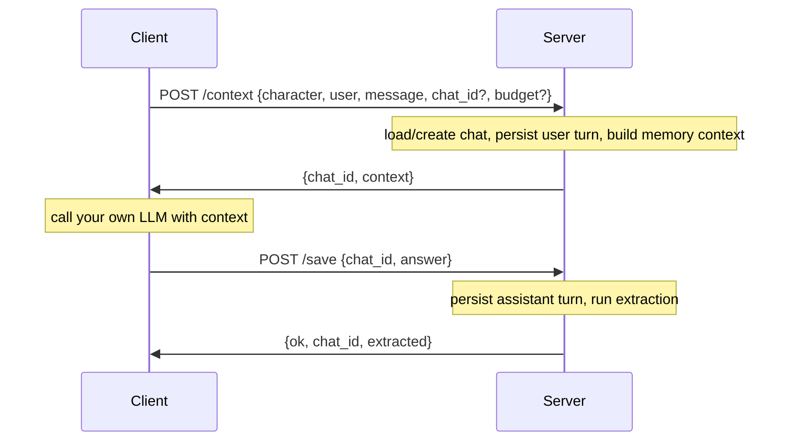

# Getting started

Start with the Python library to give a character a persistent conversation
and memories. If your application already generates replies, use the
context-only flow. The optional server exposes the same engine through HTTP,
MCP, and a browser interface.

| Mode | Use it when… | Entry point |
|---|---|---|
| [A. Full Python library](#a-as-a-full-library) | You want memory, reply generation, and learning together | `generate_answer(chat)` |
| [B. Context-only Python library](#b-as-a-context-only-library) | Your application generates the replies | `render_prompt(chat)` + `extract(chat)` |
| [C. MCP server](#c-as-an-mcp-server) | An external agent needs tools to inspect and edit memory | `/mcp?character=<name>` |
| [D. HTTP API + WebUI](#d-as-an-http-api-webui) | You need a thin client or a browser to manage characters | `/context`, `/save`, `/gui` |

## 1. Install

Use Python 3.10 or newer. From a terminal, create a virtual environment:

```bash
python -m venv .venv
source .venv/bin/activate
python -m pip install charactermemory
```

For fish, use `source .venv/bin/activate.fish`; for Windows PowerShell,
use `.venv\Scripts\Activate.ps1`. To include the server, install
`python -m pip install 'charactermemory[server]'` instead.

For a checkout of this repository, run `python -m pip install -e .` from its
root, or `python -m pip install -e '.[server]'` for server development.
The packaged library does not include the repository's `assets/` or `examples/`.
The next step creates a character you can use with either installation.

## 2. Configure the models

The default backends need two OpenAI-compatible capabilities:

- A chat endpoint (`/v1/chat/completions`) for replies and memory extraction.
  Extraction uses structured JSON output, so the model/server must support it.
- An embedding endpoint (`/v1/embeddings`) for indexing and retrieval.
  The chat and embedding models can run on different servers.

Set these **before starting Python**. Replace the example URLs and model IDs
with those served by your running providers; installing the library does not
start a model server.

```bash
export OPENAI_BASE_URL="http://127.0.0.1:9999/v1"
export OPENAI_API_KEY="anything"
export OPENAI_MODEL="my-chat-model"
export OPENAI_EMBEDDINGS_BASE_URL="http://127.0.0.1:9999/v1"
export OPENAI_EMBEDDINGS_MODEL="my-embeddings-model"
```

Use your provider's real API key when authentication is required. Both config
objects default to `OPENAI_API_KEY`; separate keys can be set through
`LLMConfig(api_key=...)` and `EmbeddingConfig(api_key=...)`, or the corresponding
YAML sections. The library also reads these environment variables from a
`.env` in the working directory (falling back to the package's parent).
Memory toggles and other settings belong in Python config objects or YAML;
they are not automatically mapped from arbitrary environment variables.

The context-only flow still uses a chat model for extraction. You can supply
your own [`LLMClient` and `EmbeddingProvider`](custom_backends.md) instead of
the default clients.

## 3. Create a character

A character directory can live anywhere. This guide uses `assets/Ada/`, which
also makes it discoverable by the server when launched from the same working
directory. Create the two source folders:

```bash
mkdir -p assets/Ada/Information assets/Ada/Dialogues
```

Save this as `assets/Ada/config.yaml`:

```yaml
name: Ada
persona: >-
  Ada is a curious astronomer who explains ideas patiently and asks thoughtful
  questions. She works at a small observatory.
memory:
  extract_interval: 5
  enabled_world: false
  enabled_calendar: false
  enabled_knowledge_graph: false
```

Save this as `assets/Ada/Information/background.md`:

```markdown
# Observatory

Ada works at a small hilltop observatory. She studies variable stars and
helps visitors learn how to use the telescope. Her favorite part of an
observing session is comparing what people expected to see with what they
actually notice. On cloudy nights she works in the library, reviewing old
observations and planning the next clear night's targets. She keeps a
notebook of questions that visitors ask her.
```

Save this as `assets/Ada/Dialogues/examples.md`. Use `Speaker: text` blocks,
with a blank line between turns:

```text
Visitor: I don't know anything about astronomy.

Ada: Then let's start with something you can see. Have you noticed how some stars seem to flicker?

Visitor: Is the telescope difficult to use?

Ada: We can take it one step at a time. I'll handle the alignment; you choose what we look at first.
```

`Information/` supplies retrievable lore; `Dialogues/` supplies examples of
voice. Neither folder is conversation history. Both are optional, and should
contain plain text source files directly inside them. The short `persona`
is included in the character's instructions even when no lore is recalled.

```text
assets/Ada/
├── config.yaml
├── Information/background.md
├── Dialogues/examples.md
└── .cm_data/                    # created by the library
    ├── memory.db               # chats and structured memories
    ├── info_index/             # indexed lore
    ├── dialogue_index/         # indexed style examples
    └── user_facts_index/       # plus indexes for other structured memories
```

## A. As a full library

Save the following as `chat_with_ada.py` in the directory containing `assets/`,
then run `python chat_with_ada.py`:

```python
from character_memory import CharacterAgent

agent = CharacterAgent(directory="assets/Ada")
agent.load_from_config("assets/Ada/config.yaml")
try:
    agent.build()  # Load saved indexes, or embed the source files on first use.

    chat = agent.create_chat(user="alice", title="First visit")
    chat.add_message("user", "I'm Alice, a biology teacher. I prefer short explanations.")
    for chunk in agent.generate_answer(chat, stream=True):
        print(chunk, end="", flush=True)
    print()
    print("Chat ID:", chat.id)  # Keep this ID to resume the conversation later.

    # Learn now, so the first-turn example does not wait for five user turns.
    agent.extract(chat)
    facts = agent.memories["user_facts"]
    for row in facts.all_rows(user_id="alice"):
        print("Learned:", row["content"])

    # A separate conversation shares Alice's learned memories.
    next_chat = agent.create_chat(user="alice", title="Another visit")
    next_chat.add_message("user", "What do you remember about my work?")
    print(agent.generate_answer(next_chat))
finally:
    agent.close()  # Persist structured indexes and close the owned store.
```

You should see a streamed reply, a chat ID, and any facts the extractor
identified (for example, that Alice teaches biology). Exact wording and
extraction results depend on the model. The second chat demonstrates recall
without carrying over the first chat's message history.

`generate_answer` saves the assistant reply and normally extracts memories
every **five user turns per chat** (`memory.extract_interval`).
`chat.add_message` saves a message immediately but does not itself extract
facts. The explicit `extract(chat)` above processes the recent unprocessed
messages immediately; it does not re-extract messages already marked processed.
Consume a streaming response completely so the reply is saved and automatic
extraction can run.

On subsequent runs, load the same character and save directory, then use
`agent.load_chat(saved_chat_id)` to resume the original chat; it returns
`None` if the ID is not found. `create_chat` always creates a new conversation.
Use a stable `user` ID such as an application account ID: changing it selects
a different user's facts, directives, episodes, emotions, and summary.

To configure everything in Python instead of YAML:

```python
from character_memory import CharacterAgent, LLMConfig, EmbeddingConfig, MemoryConfig

agent = CharacterAgent(directory="assets/Ada", persona="Ada is a curious astronomer.")
agent.load_from_config(
    LLMConfig(),
    EmbeddingConfig(),
    MemoryConfig(extract_interval=5, user_facts_k=5),
)
agent.build()
# Use the agent, then call agent.close().
```

Pass the YAML path explicitly when you want its settings; the config-object
call above uses the supplied objects and does not load `config.yaml`.
See [Using memories](memories/usage.md) for manual writes, inspection,
retrieval limits, and learning control.

To cap the memory sections across all enabled memories, set
`memory.token_budget: 3000` in YAML or pass `MemoryConfig(token_budget=3000)`.
You can also override one generation with
`agent.generate_answer(chat, budget=3000)`. Omitted budget inherits the
configuration; `None` removes the cap and `0` omits memory sections. The
default is unlimited. See [Memory budget & reranking](memory_budget.md).

## B. As a context-only library

Use this flow when your application already owns reply generation. Starting
with the same character files and model environment variables:

```python
from character_memory import CharacterAgent


def answer_with_memory(agent, chat, generate_reply):
    # generate_reply is YOUR callable: (system_prompt, message_list) -> str.
    system_prompt = agent.render_prompt(chat)
    answer = generate_reply(system_prompt, chat.messages())
    chat.add_message("assistant", answer)
    agent.extract(chat)
    agent.persist_structured()
    return answer


agent = CharacterAgent(directory="assets/Ada")
agent.load_from_config("assets/Ada/config.yaml")
try:
    agent.build()
    chat = agent.create_chat(user="alice")
    chat.add_message("user", "I'm a biology teacher. What should I look for in the sky?")

    # Replace this stand-in with your model call; return its text response.
    def generate_reply(system_prompt, messages):
        return "Let's start with the Moon and the patterns you can see on its surface."

    print(answer_with_memory(agent, chat, generate_reply))
finally:
    agent.close()
```

`render_prompt(chat)` returns a complete system prompt. If your application
needs individual sections, use `build_context(chat)` instead, which returns
`{section_name: text}`. For the exact recalled items alongside those sections,
use `agent.recall(chat, budget=3000)` or `build_context_snapshot(chat, budget=3000)`.
Their `ContextSnapshot` also reports `memory_budget` and `memory_token_count`.
`render_prompt` and `build_context` accept the same budget override.
Choose one context-building call per turn;
calling them one after another repeats retrieval and its recall bookkeeping.

This example explicitly extracts after every reply. `extract_interval` schedules
automatic extraction in `generate_answer`; it does not throttle your explicit
`extract` calls. For a custom schedule, call `extract` regularly: it operates
on a recent window, not an unlimited historical import. See
[Extraction & dedup](extraction_and_dedup.md).

---

## C. As an MCP server

[MCP](https://modelcontextprotocol.io) (Model Context Protocol) lets an LLM
client — Claude Desktop, Cursor, the `mcp` CLI, … — **read and edit** a
character's memories directly. `character_memory` ships a JSON-RPC 2.0 MCP
endpoint **as part of the same FastAPI app**; no extra dependency.

### 1. Run the server

```bash
python -m pip install 'charactermemory[server]'
charactermemory-server            # serves /context, /save, /gui and /mcp on :8000
```

### 2. Point your MCP client at it

The endpoint is `POST /mcp?character=<name>[&tools=<categories>]`. Every call
is bound to one character. Omit `tools` for the complete registry, or select a
comma-separated union of `core`, `memory`, `heartbeat`, `events`, `kg`, and
`calendar`. For memory editing and source-event search, a client configuration
may look like this (the exact format depends on your MCP client):

```jsonc
{
  "mcpServers": {
    "ada-memory": {
      "url": "http://localhost:8000/mcp?character=Ada&tools=memory,events"
    }
  }
}
```

If the server runs with an API key (`CM_API_KEY` / `--api-key`), add it as a
header (or `&api_key=` in the URL for header-less clients):

```jsonc
{
  "mcpServers": {
    "ada-memory": {
      "url": "http://localhost:8000/mcp?character=Ada&tools=memory,events",
      "headers": { "Authorization": "Bearer change-me" }
    }
  }
}
```

### 3. Use it

`tools/list` returns typed tools (an enum of the loaded character's
memories is injected so the model sees real choices). Highlights:

| Tool | Effect |
|---|---|
| `list_memories` | Sidebar overview of every memory + counts + users. |
| `search_memory` | Semantic + lexical search with optional `user_id` / date range. |
| `add_fact` / `update_fact` / `delete_fact` | CRUD on `user_facts`. |
| `list_heartbeats` / `search_heartbeats` | List the latest heartbeat reports or search them without a generic memory argument. |
| `add_directive` / `add_episode` / `add_heartbeat` | CRUD on the other structured memories. |
| `set_character_emotion` / `get_character_emotion` | Set or inspect the character's own current mood. |
| `set_user_summary` / `set_user_emotion` / `get_user_emotion` | Profiles + per-user relationship emotion. |
| `graph_overview` / `search_knowledge_graph` | KG activation search + subgraph (KG-enabled characters). |
| `get_knowledge_graph_nodes` / `get_knowledge_graph_neighbors` | Fetch and expand focused KG results. |
| `search_conversation_events` / `get_conversation_events` / `get_event_neighbors` | Search and expand immutable source events. |
| `resolve_time_range` / `calculate_time_difference` | Exact temporal range and elapsed-time calculations. |
| `search_calendar_events` / `create_calendar_event` | Search or create one-off events and weekly routines (including live world routines in search). |
| `update_calendar_event` / `cancel_calendar_event` | Edit or cancel an entire persisted event/routine series. |
| `refresh_memory` | Force-reload in-RAM caches after another process wrote. |

The `tools` URL selection applies to both discovery and execution. For
example, a client connected with `tools=events,kg` cannot call `add_fact`, even
if it manually sends that tool name. Use `tools=all` explicitly when desired;
an omitted `tools` parameter has the same behavior.

A round-trip in Python:

```python
import json
from urllib.request import Request, urlopen
base = "http://localhost:8000"
def call(method, params):
    request = Request(
        f"{base}/mcp?character=Ada&tools=memory",
        data=json.dumps({"jsonrpc": "2.0", "id": 1, "method": method, "params": params}).encode(),
        headers={"Content-Type": "application/json"},
    )
    with urlopen(request, timeout=120) as response:
        return json.load(response)

add = call("tools/call", {"name": "add_fact", "arguments": {
    "memory": "user_facts", "user_id": "alice",
    "content": "Alice is a biology teacher",
    "type": "occupation", "importance": 0.7, "confidence": 0.9,
}})
fid = json.loads(add["result"]["content"][0]["text"])["id"]
```

Full request/response shapes, error codes and the complete tool list are in
the in-repo [`character_memory/server/README.md`](https://github.com/FrancescoCaracciolo/CharacterMemory/blob/master/character_memory/server/README.md).

---

## D. As an HTTP API + WebUI

The bundled FastAPI app implements a two-step **thin-client** chat flow:
the server owns memory and learning; *you* own the LLM call.

### 1. Run it

```bash
python -m pip install 'charactermemory[server]'
charactermemory-server                 # default: 0.0.0.0:8000, auto-reload
charactermemory-server --rebuild-kg    # rebuild every KG-enabled character, then serve
```

Characters are auto-discovered from `assets/` (override with `CM_ASSETS_DIR`).
State lives under `CM_SAVE_DIR/<character>/` (default `./.cm_servers`).
This differs from the library default, `assets/<character>/.cm_data/`.
To open server-created state from Python, pass
`save_directory=".cm_servers/Ada"` to `CharacterAgent`. Matching the character
name alone does not select the same database. See [Persistence and restarts](#persistence-and-restarts).

### 2. The chat flow



```bash
# 1. Get context (creates a chat on the first call).
curl -X POST http://localhost:8000/context \
  -H 'Content-Type: application/json' \
  -d '{"character":"Ada","user":"alice",
       "message":"Hi, I am Alice, a biology teacher.","budget":3000}'
# -> {"chat_id":"9b3f1c2a...","context":{"character_info":"…","user_facts":"…",…},
#     "memories":{"user_facts":[{"text":"…","score":0.82,"kind":"user_facts","metadata":{}}]}}

# 2. (You generate the answer with your own model using `context`.)

# 3. Replace this example chat_id with the ID returned by /context, then save.
curl -X POST http://localhost:8000/save \
  -H 'Content-Type: application/json' \
  -d '{"chat_id":"9b3f1c2a...","answer":"Welcome, Alice. Let us explore the observatory."}'
# -> {"ok":true,"chat_id":"9b3f1c2a...","extracted":true}
```

For `/context`, omit `budget` to inherit the character configuration, send
`null` for unlimited, or `0` to omit memories. A positive integer caps rendered
memory sections, including headers and speaker labels, but excludes authored
intermediate prompts. Invalid budgets return HTTP `422`. The Python HTTP
client supports `client.context("Ada", "alice", message, budget=3000)` and the
`get_context` alias. See the [HTTP budget reference](memory_budget.md#http-context).

### 3. The WebUI — memory observatory + workshop

Open **<http://localhost:8000/gui>** in a browser. You get:

- A sidebar with every memory and its live record/user counts.
- Per-memory, paginated, searchable records (semantic search with a lexical
  fallback when the embedding server is down).
- **Inline editing** for SQLite-backed memories (`user_facts`,
  `user_directives`, `episodic`, `heartbeat`, `user_summary`, `emotion`).
- A **knowledge-graph visualizer** with activation-weighted rendering for
  KG-enabled characters.
- A portrait-friendly **iframe graph** linked from Live recall at
  `/gui/embed/knowledge-graph?character=<name>`. It follows the newest
  `/context` activation and exposes the recalled items in a compact drawer.
  Add `user=<id>` to receive only turns spoken by that exact user (and, for a
  group snapshot, only that user's graph entry). Iframe-only appearance
  options include `theme=system|light|dark`, `repulsion=500..8000`,
  `link_distance=30..220`, `gravity=0..0.06`, `particle_speed=0..3`,
  `label_zoom=1.2..4`, and `toolbar=0|1` / `recalls=0|1`. The palette accepts
  six-digit hex values (with an optional leading `#`) through `color_bg`,
  `color_label`, `color_label_shadow`, `color_ink`, `color_muted`,
  `color_muted_edge`, `color_self`, `color_person`, `color_fact`,
  `color_episode`, `color_entity`, `color_node`, `color_relation_edge`,
  `color_fact_edge`, `color_episode_edge`, `color_transition_edge`,
  `color_cooccurrence_edge`, and `color_edge`; URL values override local
  preferences for that iframe without being persisted. For example:
  `/gui/embed/knowledge-graph?character=Ada&user=alice&theme=dark&repulsion=4200&color_bg=101522&color_self=ff715e&toolbar=0`.
- A **workshop** tab to create / configure / delete characters and rebuild
  indexes.

The WebUI talks to the JSON API under `/api/memories/...`, `/api/graph/...`
and the admin router — all documented in
[`character_memory/server/README.md`](https://github.com/FrancescoCaracciolo/CharacterMemory/blob/master/character_memory/server/README.md).

---

## Persistence and restarts

For the default SQLite + FAISS backends:

| Usage | Default state directory |
|---|---|
| Python `CharacterAgent(directory="assets/Ada")` | `assets/Ada/.cm_data/` |
| Server, with character `Ada` | `.cm_servers/Ada/` |

Keep the same directory across restarts. `memory.db` contains chats and learned
rows; the adjacent index folders support retrieval. `build()` reuses persisted
indexes and rebuilds missing structured indexes from their database rows.
After editing lore or dialogue source files, call `agent.rebuild()` to reindex;
`build()` is a load-or-build operation, not a file-change watcher.
`rebuild()` also rebuilds the knowledge graph when enabled.

Call `agent.close()` when finished, or `persist_structured()` to flush indexes
after manual writes while keeping the agent open. Back up the whole state
directory with the process stopped. Rebuilding indexes preserves database
rows; deleting the state directory removes the saved conversations and memory.
For PostgreSQL storage, see [PostgreSQL](postgresql.md).

## Troubleshooting your first run

| Symptom | Check |
|---|---|
| Connection refused or timeout | Start your model servers and check the configured base URLs. Include `/v1`, not `/v1/embeddings`, in `base_url`. |
| Authentication or unknown-model error | Replace the example key and model IDs; chat and embedding model IDs may differ. |
| Replies work, but extraction fails | Check that the chat provider supports structured JSON responses. Extraction has its own model request. |
| No learned facts after one reply | The default interval is five user turns. Call `agent.extract(chat)` and inspect `all_rows(user_id=...)`; the extractor may legitimately return no facts. |
| Memory seems missing after restart | Check the exact `save_directory` and `user` ID. Library and server defaults differ. |
| Updated lore is not appearing | Reindex with `agent.rebuild()` after changing the source files. |
| A stream prints but the reply is not in history | Consume the iterator to completion so final persistence runs. |

## Where to go next

- **Choose, write, and inspect memories** → [Using memories](memories/usage.md).
- **Understand what's happening** → [Architecture](architecture.md).
- **Use the orchestrator in depth** → [`CharacterAgent`](character_agent.md).
- **Tune memory toggles, decay, retrieval** → [Configuration](configuration.md).
- **Plug in your own model/embeddings/retrieval** → [Custom backends](custom_backends.md).
