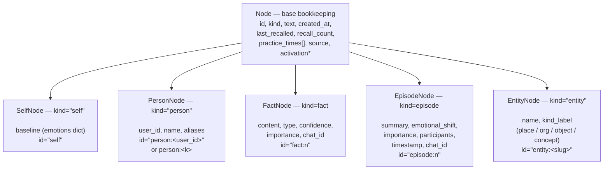
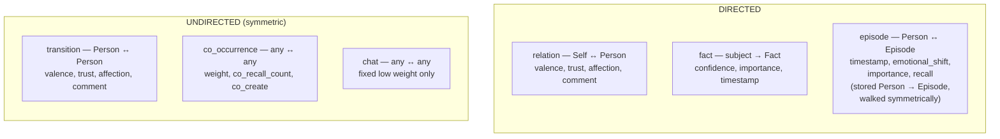
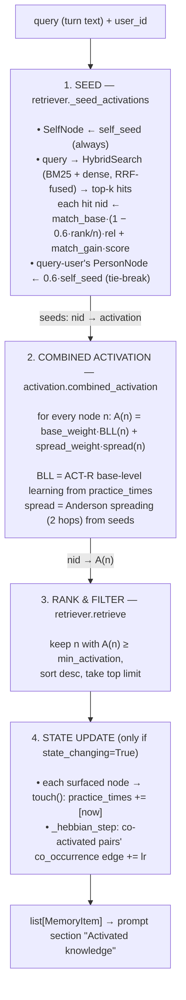
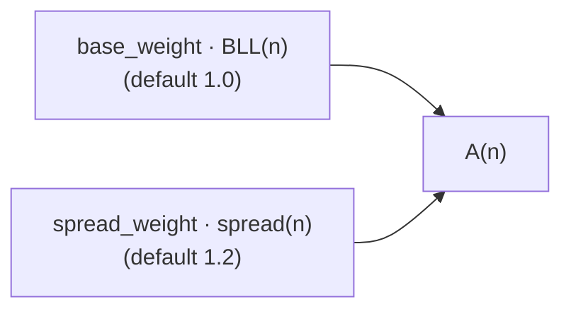

# Knowledge Graph Retrieval — Diagrams & Scoring Formulas

This document is a focused, formula-level description of the **Knowledge
Graph (KG) retriever**: what its nodes/edges are, how retrieval flows, and
the exact math behind the activation score of every node. It complements
[`knowledge_graph.md`](knowledge_graph.md), which describes the broader
design (ingestion, persistence, integration). All formulas here are derived
**directly from the code** in `character_memory/knowledge_graph/` — every
symbol is annotated with the file and line it comes from so the two can be
checked against each other.

> **Source of truth note.** The KG is an *additive, opt-in, derived* view.
> The structured memories (`user_facts`, `user_summary`, `emotion`,
> `episodic`) remain the source of truth; the graph reads them through their
> public APIs and never writes back.

---

## 1. What lives in the graph

The graph is **per-character** and **shared across users**. Every node carries
a common bookkeeping block plus kind-specific data; every edge carries a
generic `weight ∈ [0,1]` plus optional richer signals.

### 1.1 Node types



* activation is transient (set at retrieval, never persisted)

Wiki source-anchor facts carry `internal=true`. They remain in the graph for
provenance and spreading activation, but normal retrieval and graph views
filter them out; diagnostic APIs can opt in with `include_internal=true`.

| Kind | Class | Stands for | Source memory |
|------|-------|------------|---------------|
| `self` | `SelfNode` | The character. Singular (`id="self"`). Holds resting emotional `baseline`. Always seeded at retrieval. | `emotion.baseline` |
| `person` | `PersonNode` | A person the character knows. `user_id` + `name` + `aliases`. | `user_summary` (or extracted from `user_facts` / wiki) |
| `fact` | `FactNode` | One learned or atomic wiki fact. Carries `confidence`, `importance`, `chat_id`; full wiki source anchors are marked `internal`. | `user_facts` (`type='general'`), or `type='wiki'` from wiki |
| `episode` | `EpisodeNode` | Something that happened. Carries sparse vector `emotional_shift`, `importance`, `participants`, `chat_id`. | `episodic` (or wiki story events) |
| `entity` | `EntityNode` | A named, distinctive thing (place/organization/object/concept). Extracted by the LLM. | extracted from `user_facts` and wiki |

**Stable IDs** (`graph.py`): `self`, `person:<user_id>`, `entity:<slug>`
(`slugify(name)`), `fact:<n>` / `episode:<n>` (auto-incremented integers
scoped to their kind; counters are part of graph state so re-ingestion does
not collide).

### 1.2 Edge types



| Kind | Class | Between | Carries (extra) | Symmetric? |
|------|-------|---------|------------------|------------|
| `relation` | `RelationEdge` | Self ↔ Person | `valence`,`trust`,`affection` ∈ [-1,1], `comment`, `provenance` | stored directed Self→Person |
| `fact` | `FactEdge` | subject (Person/Entity/Self) → Fact | `confidence`,`importance`,`timestamp` | directed |
| `transition` | `TransitionEdge` | Person ↔ Person | `valence`,`trust`,`affection`,`comment` | **yes** (`SYMMETRIC_KINDS`) |
| `episode` | `EpisodeEdge` | Person ↔ Episode | `timestamp`, sparse vector `emotional_shift`, `importance`,`recall` | stored Person→Episode |
| `co_occurrence` | `CoOccurrenceEdge` | any ↔ any | `weight`,`co_recall_count`,`co_create` | **yes** |
| `chat` | `ChatEdge` | any ↔ any | generic `weight` only (fixed low) | **yes** |
* `SYMMETRIC_KINDS = {transition, co_occurrence, chat}` (`edges.py`): stored
  once with a canonical sorted `(src,dst)` ordering; walked from either
  endpoint.
* Directed kinds (`relation`, `fact`, `episode`) are walked out of `src`
  **only**, so activation flows in the semantic direction (Person → Fact,
  Self → Person, …).
* LLM wiki ingestion uses native `RelationEdge`, `FactEdge`, and `EpisodeEdge`
  links. Self receives a fact/episode edge only when the extraction explicitly
  marks Kurisu as involved; hidden section anchors use native `FactEdge`s from
  the people/entities actually present.
* Edges merge **by max** on re-ingestion (`_merge_edge`); vector emotion shifts
  the value with the larger magnitude; `co_recall_count` is *not* summed on
  re-ingest (only the Hebbian step increments it).

---

## 2. Retrieval pipeline (the whole flow)



The four stages map to:

| Stage | Function | Code |
|-------|----------|------|
| 1 Seed | `_seed_activations` | `retriever.py` |
| 2 Combined | `combined_activation` | `activation.py` |
| 3 Rank/filter | `retrieve` | `retriever.py` |
| 4 State update | `touch` + `_hebbian_step` | `retriever.py` |

The next section gives the exact formula for each box.

---

## 3. The activation score — formula by formula

The retrieval score of a node is its **activation** `A(n)`. Below, every
formula is exact; defaults are the `KnowledgeGraphConfig` values
(`retriever.py`).

### 3.1 Base-level learning — `BLL(n)`

*Source: `activation.base_level_activation` (`activation.py`).*

Let `age = max(10⁻³, now − created_at)`, decay `d` (default `0.5`), and
`c = recall_count`. Prompt exposure is telemetry with a bounded familiarity
factor rather than an independent practice event that resets age:

```
  familiarity = 1 + 0.10 · c/(c + 10)
  mass        = age^(-d)
  retained    = max(-2.0, ln(mass))
  BLL(n)      = retained + ln(familiarity)
```

When `created_at` is absent, the earliest legacy `practice_times` value is
used; a node without either keeps the `-2.0` floor. With the optional
half-life (default one week), the positive mass becomes:

```
  mass := mass · exp( −age / (2 · decay_half_life) )
```

Applying exponential decay before `ln` ensures negative BLL moves toward the
established `-2.0` floor rather than spuriously increasing toward zero. Direct
query seeds and spreading can still recover a node at the floor.
`last_recalled` and `practice_times` remain persisted for compatibility and
diagnostics but do not renew retention.

### 3.2 Seeds — `seeds(nid)`

*Source: `retriever._seed_activations`.*

The seed map provides the initial activation injected before spreading.

```
  seeds[self]        = self_seed                                  (always; default 0.8)

  for each hybrid hit at rank r (0-based) of n hits, node id nid:
      rank_base = match_base · (1 − 0.6 · r / n)                 (default match_base = 4.0)
      rel = normalized_relevance(h)                                  (0…1)
      seeds[nid] += rank_base · rel + match_gain · score(h)      (default match_gain = 3.0)

  if user_id given and person:<user_id> exists:
      seeds[person:<user_id>] += 0.6 · self_seed                 (tie-break toward "about me")
```

* `score(h)` is the RRF-fused hybrid score from `HybridSearch.search`
  (BM25 + dense similarity, fused with reciprocal-rank fusion — the same
  index reused across the library).
* `normalized_relevance(h)` is confidence derived from positive BM25 evidence
  and cosine similarity above the configured dense floor. The `match_base`
  still compensates for tiny raw RRF scores (~0.02–0.05), but only in
  proportion to that confidence.

### 3.3 Edge strength — `w_uv`'s `u` side

*Source: `activation._edge_strength`.*

For an edge `e` from `u` to `v`, the directional weight used by spreading is
built up from the edge's persisted `weight` and its kind-specific signals.

```
  base = clamp(edge.weight, 0, 1)

  # generic signed/unsigned dims push base up from the centre:
  for attr in (trust, affection, importance, confidence):
      if edge has attr:  base = max(base, min(1, 0.5 + 0.5·|attr|))

  # kind-specific boosts:
  RelationEdge : base = max(base, min(1, 0.4 + 0.6·max(|valence|,|trust|,|affection|)))
  EpisodeEdge  : base = max(base, min(1, 0.3 + 0.5·impact(emotional_shift)))
  FactEdge     : base = max(base, min(1, 0.3 + 0.5·confidence))
```

So `ChatEdge` (generic `weight` only, low) stays light, while a strongly
charged relationship or a high-confidence fact pulls harder.

### 3.4 Node strength — `w_uv`'s `v` side

*Source: `activation._node_strength`.*

The destination node also contributes a strength factor (importance /
confidence / emotional magnitude), capped at `1.5`:

```
  s = 0.4                                                          (floor)
  if n has importance  v₁: s = max(s, v₁·0.6 + 0.2)
  if n has confidence  v₂: s = max(s, v₂·0.4 + 0.2)
  if n has emotional_shift e: s += 0.2·impact(e)                   (episodic boost)
  return min(1.5, s)
```

The full per-edge spreading weight is then:

```
  w_uv = _edge_strength(edge u→v) · _node_strength(v)
```

### 3.5 Spreading activation — `spread(n)`

*Source: `activation.spread_activation`.* Classic Anderson update, applied
hop by hop for `hops` steps (default `2`).

Let:

* `gain_h = gain · hop_decay^(h−1)` — per-hop attenuation (defaults
  `gain = 0.35`, `hop_decay = 0.6`).
* `fan(u) = degree(u)` — out-degree (directed kinds) + both endpoints
  (symmetric kinds); the **fan effect** (a node pointing at many things
  spreads less to each).
* `w_uv` as in §3.3–3.4.

The hop update is:

```
  A_v += gain_h · ( A_u · w_uv ) / fan(u)
```

Iterated for `h = 1 … hops`, each hop propagating only the *frontier*
received in the previous hop (so contributions accumulate on `A` but the
wavefront does not re-use already-propagated mass). A node with `A_u ≤ 0` or
`fan(u) = 0` contributes nothing. Propagation stops early if a hop produces
no new frontier.

The 2-hop default keeps the activation cloud **local** but lets it connect,
e.g., a query-matched entity to a fact two hops away through a shared person.

#### Engines and caching

`spread_activation(engine=...)` has two backends selected by
`KnowledgeGraphConfig.activation_engine`:

* **scalar** — the reference Python walker above; exact neighbour order and
  float sums, used for small graphs and as the correctness oracle.
* **numeric** — a NumPy sparse snapshot of the weighted adjacency
  (`numeric_activation.py`). `auto` (the default) picks numeric once the graph
  reaches `NUMERIC_MIN_NODES` **or** `NUMERIC_MIN_EDGES` (1,200 / 8,000) —
  either alone suffices, because spreading cost scales with edges and a
  small-but-dense graph is the scalar walker's worst case.

The weighted adjacency is query-independent, so the numeric snapshot is
cached across queries on the graph and keyed by the graph's mutation clock
(`KnowledgeGraph.version`, bumped by every mutator). Invalidation rules
matter for code that writes to a live graph:

* Structural/attribute changes made through the `KnowledgeGraph` API
  (add/upsert/remove node or edge, `mark_*_scope`, merges) bump the version
  automatically — the next query rebuilds the snapshot.
* **Raw in-place writes** (e.g. `edge.weight += 0.1` directly on a stored
  object) are invisible to the clock: call `graph.bump_version()` after them,
  or `graph.touch_edge_strength(edge.id)` for a single edge's strength change
  (patched row-wise, no rebuild).
* `add_co_occurrence` inserts brand-new edges **quietly**: their rows are
  appended to every live snapshot (`_appended_edge_ids` journal), so the
  Hebbian step's learning during retrieval never triggers a rebuild. On a
  large graph the never-co-fired pair space effectively never saturates, so
  this is the load-bearing fast path for state-changing retrieval.
* `node.touch()` (recall telemetry) intentionally does **not** bump: it feeds
  only the per-query BLL, never a cached snapshot.

Because the update rule is linear in the seed vector, group retrieval
(`retriever.retrieve_multi`) computes the seed search, BLL pass and shared
spreading once and composes each participant's PersonNode bias in
separately: `spread(shared + bias_p) = spread(shared) + spread(bias_p)`.

### 3.6 Combined activation — `A(n)` (the final score)

*Source: `activation.combined_activation`.*

For **every** node in the graph (not just seeds), the final activation is:



with the SelfNode guaranteed a seed (`0.5`) if the caller did not provide one.
`spread(n)` is `0` for nodes never reached by a wavefront; `BLL(n)` is the
floor `-2.0` for never-practiced nodes. This is why an unmatched but
well-practiced neighbour can still surface: it gets a positive BLL and a
share of spread from a matched neighbour.

### 3.7 Hebbian reinforcement (learning during retrieval)

*Source: `retriever._hebbian_step`.* Only runs when `state_changing=True`
(the default; read-only previews pass `False`).

Let `fired = { n surfaced | n.activation ≥ hebbian_threshold }`
(default `0.15`). For every unordered pair `(a, b)` in `fired`:

```
  edge = co_occurrence(a, b)            # lazily created at weight 0.05 if absent
  edge.co_recall_count += 1
  edge.weight = min(edge.creation_weight + 0.10,
                    edge.weight + hebbian_lr)            # default hebbian_lr = 0.05
```

This is a bounded Hebbian rule: repeated co-retrieval strengthens the
`co_occurrence` edge only up to 0.10 above its creation weight. Legacy edges
above that bound are clamped when scored without rewriting stored telemetry.
`co_recall_count` is incremented only here.

Each surfaced node also gets `touch(now)`, appending `now` to
`practice_times` for compatibility and bumping `recall_count` /
`last_recalled`; only the bounded count factor feeds the next retrieval.

---

## 4. Worked ranking example

Concrete walk-through for `q = "the phonewave"` over a graph where:

* `entity:phonewave` is a top hybrid hit (`score ≈ 0.03`, rank 0).
* `fact:7` ("The PhoneWave is a microwave-… ") is hit at rank 1.
* `person:okabe` is connected to `fact:7` via a `fact` edge (high confidence).
* `self` is seeded as always.

Step-by-step:

1. **Seeds**
    * `seeds[self] = 0.8`
    * `seeds[entity:phonewave] = 4.0·(1−0) + 3.0·0.03 = 4.09`
    * `seeds[fact:7] = 4.0·(1 − 0.6·1/2) + 3.0·0.02 = 2.8 + 0.06 = 2.86`
2. **BLL** — computed for all nodes. `fact:7`, practiced recently, gets a
   high BLL; a stale unrelated `fact:42` gets a low (possibly negative) BLL.
3. **Spreading (2 hops)**
    * Hop 1: `fact:7` spreads to `person:okabe`:
      `gain_1 = 0.35`; `w = (0.3+0.5·conf) · strength(person:okabe)`;
      contribution `= 0.35 · (2.86 · w) / fan(fact:7)`.
    * Hop 2: `person:okabe` spreads to its other facts/episodes, attenuated
      by `gain_2 = 0.35·0.6 = 0.21`.
4. **Combined** — `A = 1.0·BLL + 1.2·spread`. The matched `entity:phonewave`
   and `fact:7` dominate (their seed term dominates BLL noise); `person:okabe`
   and related episodes surface a hop or two away via spread.
5. **Rank/filter** — keep `A ≥ min_activation` (= 0 default), sort desc,
   take top `limit` (default 6) → rendered as `MemoryItem`s into the
   "Activated knowledge" prompt section.
6. **State update** — surfaced nodes `touch(now)`; the
   `(entity:phonewave, fact:7)` pair (both above `0.15`) reinforces a
   `co_occurrence` edge for next time.

---

## 5. One-glance summary

```
FINAL SCORE per node:
    A(n) = base_weight · BLL(n)  +  spread_weight · spread(n)

BLL(n) = ln( Σ_j Δt_j^(−d) ) · exp( −age / (2·half_life) )      [ACT-R + recency]

spread:  A_v += (gain · hop_decay^(h−1)) · ( A_u · w_uv ) / fan(u)   [Anderson, 2 hops]

w_uv    = edge_strength(u→v) · node_strength(v)

seed(n) = self_seed                                      (SelfNode, always)
         + match_base·(1−0.6·rank/n) + match_gain·s(h)   (hybrid hits)
         + 0.6·self_seed                                  (query-user's person)

Hebbian: if two surfaced nodes both ≥ hebbian_threshold,
         their co_occurrence edge.weight += hebbian_lr
         (capped at creation_weight + 0.10)
```

| Symbol | Default | Where |
|--------|---------|-------|
| `decay` `d` | `0.5` | `KnowledgeGraphConfig.decay` |
| `decay_half_life` | 1 week (s) | `KnowledgeGraphConfig.decay_half_life` |
| `gain` | `0.35` | `KnowledgeGraphConfig.gain` |
| `hops` | `2` | `KnowledgeGraphConfig.hops` |
| `hop_decay` | `0.6` | `KnowledgeGraphConfig.hop_decay` |
| `base_weight` | `1.0` | `KnowledgeGraphConfig.base_weight` |
| `spread_weight` | `1.2` | `KnowledgeGraphConfig.spread_weight` |
| `min_activation` | `0.0` | `KnowledgeGraphConfig.min_activation` |
| `self_seed` | `0.8` | `KnowledgeGraphConfig.self_seed` |
| `match_base` | `4.0` | `KnowledgeGraphConfig.match_base` |
| `match_gain` | `3.0` | `KnowledgeGraphConfig.match_gain` |
| `hebbian_threshold` | `0.15` | `KnowledgeGraphConfig.hebbian_threshold` |
| `hebbian_lr` | `0.05` | `KnowledgeGraphConfig.hebbian_lr` |

All defaults are in `character_memory/knowledge_graph/retriever.py`
(`KnowledgeGraphConfig`); the pure functions are in
`character_memory/knowledge_graph/activation.py`.
