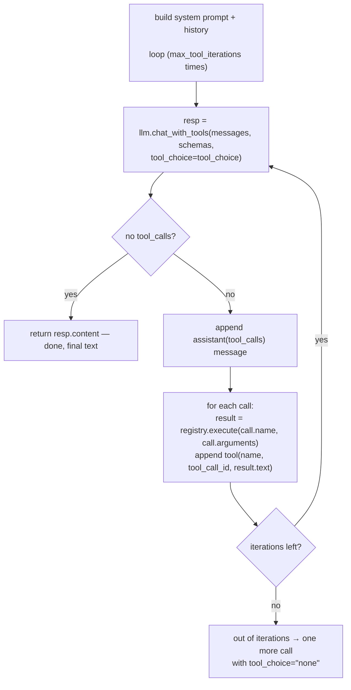

# Tools (function calling)

The character can invoke **tools** mid-turn through a provider-neutral tool
contract. Tool implementations declare ordinary JSON Schema and return plain
text or structured Python data; provider adapters translate that contract to
their wire format. The bundled OpenAI-compatible client is one such adapter.
This is a *separate seam* from the MCP server's tools
(which expose memory operations to *external* clients): here the **LLM
itself** decides to call a tool while composing a reply.

The event, KG, heartbeat, and calendar implementations below are provider-neutral and
are also adapted by the external MCP server. MCP clients can select those
surfaces with `?tools=events`, `?tools=kg`, `?tools=heartbeat`, or
`?tools=calendar`; this URL filter applies to both tool discovery and
execution.

- Pass `tools=…` to `CharacterAgent.generate_answer(...)` to enable it.
- `tools=None` (the default) is the legacy single-shot path, bit-for-bit
  unchanged. Discord / CLI / admin API are unaffected.
- The built-in **memory self-tools** (`agent.memory_tools()`) are read-only —
  writes stay on the extractor / MCP path so a character can't bypass dedup
  by writing its own memories mid-chat. `agent.calendar_tools(chat)` adds
  scoped calendar search plus deferred create/update/cancel tools; writes are
  committed atomically with the final assistant reply.

---

## Two ways to define a tool

Both produce a `Tool` instance, so a `ToolRegistry` treats them identically.

### A. Subclass `Tool` — explicit, can hold state

Best for tools that close over the agent or some service.

```python
from character_memory import Tool

class GetWeather(Tool):
    name = "get_weather"
    description = "Get the current weather for a city."
    parameters = {
        "type": "object",
        "properties": {"city": {"type": "string"}, "units": {"type": "string"}},
        "required": ["city"],
    }

    def __init__(self, api_key: str):
        self.api_key = api_key

    def run(self, city: str, units: str = "metric") -> str:
        # `run` returns the text fed back to the model as the `tool`-role message.
        return fetch(self.api_key, city, units)
```

A subclass declares three class attributes — `name` (the dispatch key, unique
per registry), `description` (shown to the model), `parameters` (a JSON-schema
dict) — and implements `run(**kwargs)`. It may return text, a JSON-compatible
`dict`/`list`, or `ToolOutput(text=..., data=...)`. `definition()` returns a
provider-neutral `ToolDefinition`; `schema()` remains the OpenAI-envelope
adapter used by `OpenAICompatibleLLM`.

### B. `@tool` decorator — concise, stateless

Schema is inferred from annotations; the description is the docstring.

```python
from character_memory import tool

@tool
def get_weather(city: str, units: str = "metric") -> str:
    """Get the current weather for a city."""
    return fetch(city, units)
```

Type inference rules (kept deliberately small):

| Python annotation | JSON-schema type |
|---|---|
| `str` | `string` |
| `int` | `integer` |
| `float` | `number` |
| `bool` | `boolean` |
| `list[X]` / `list` | `array` |
| `dict` / `dict[K, V]` | `object` |
| anything else (`Any`, unknown class) | `string` |

A parameter is **required** unless it has a default. `Optional[X]` /
`X | None` is unwrapped before mapping, so `Optional[int]` → `integer` (and
usually not required). Anything fancier (`oneOf`, enums, `$ref`) belongs on a
`Tool` subclass.

`@tool` can also be called with options:

```python
@tool(name="lookup_weather", description="…", parameters={…})
def get_weather(region: str) -> str: ...
```

The returned object is a `Tool`, **not** a callable any more — call `.run(…)`
to invoke the original, or keep a separate reference to the function.

---

## The registry — `ToolRegistry`

`ToolRegistry` (`tools/registry.py`) is what the agent loop holds. It's
permissive about what you add:

```python
from character_memory import ToolRegistry, tool

reg = ToolRegistry()
reg.add(GetWeather(api_key="…"))     # a Tool
reg.add(get_weather)                  # a @tool-decorated function
reg.add(lambda x: str(x))             # a plain callable (auto-wrapped via @tool)
reg.add([a, b, c])                    # an iterable of any of the above
```

API:

| Method | Purpose |
|---|---|
| `add(tool_or_callable_or_iterable)` | Register one or many; returns `self`. Same name → overwrites. |
| `definitions()` | Provider-neutral `ToolDefinition` objects (`name`, `description`, standard JSON `input_schema`). |
| `schemas()` | The OpenAI `tools=[...]` list (`Tool.schema()` per tool). |
| `execute(name, arguments)` | Dispatch one model call. Structured returns are exposed as `ToolResult.data` and serialized into `ToolResult.text` for the model. **Unknown tool / bad args / raised exception → `ok=False`** — one bad tool never crashes the loop. |
| `names()`, `get(name)`, `__contains__`, `__len__`, `__iter__` | Introspection. |
| `reg1 + reg2` | Compose two registries into a fresh one. |

There's also a **module-level registry** mirroring the chunker one:
`register_tool(t)`, `get_tool(name)`, `global_registry()`.

---

## The model ↔ tool loop

`generate_answer(tools=…)` runs the loop below. The argument can be a
`ToolRegistry`, a single `Tool`/callable, or a list of either — callables are
auto-wrapped via `@tool`.



Key invariants:

1. **Only the final assistant *text* is persisted.** Intermediate
   tool-call / tool-result messages stay in the in-memory `messages` list for
   the loop and are **never** written to the `messages` table — otherwise
   chat history and extraction would be polluted with tool rounds.
2. **The streaming loop uses the calls from `ToolCallEvent` directly.** The
   client already accumulates OpenAI's per-`index` argument fragments and
   emits completed calls. Do **not** re-call `chat_with_tools` per tool round
   to "recover" the structured payload.
3. **Errors are recoverable.** A failed `execute` returns a `ToolResult`
   whose text ("Unknown tool: …", "argument error: …", "raised: …") is fed
   back to the model so it can react to the failure.

### Tool-calling on a custom LLM

`LLMClient.chat_with_tools` and `chat_with_tools_stream` default to
`NotImplementedError` / a non-streaming fallback. Implement the non-streaming
variant on your subclass to get tool calling; the stream variant has a
default that delegates to it (just non-incrementally).

---

## Streaming events

With `stream=True` and `tools=…`, `generate_answer` yields a union of
dataclasses (kept as dataclasses rather than opaque dicts so the consumer
side reads cleanly):

| Event | Carries | When |
|---|---|---|
| `TextChunk` | `.text` — a delta of the assistant's visible reply | as the model streams text |
| `ToolCallEvent` | `.calls: list[ToolCall]` — the fully-assembled calls for this round | once per round (the client accumulates fragments) |
| `ToolResultEvent` | `.result: ToolResult` | once per executed tool |

```python
from character_memory import TextChunk, ToolCallEvent, ToolResultEvent

for ev in agent.generate_answer(chat, stream=True, tools=agent.memory_tools()):
    if isinstance(ev, TextChunk):
        print(ev.text, end="", flush=True)
    elif isinstance(ev, ToolCallEvent):
        print(f"\n[calling {', '.join(c.name for c in ev.calls)}]")
    elif isinstance(ev, ToolResultEvent):
        print(f"\n[result] {ev.result.text[:120]}")
```

Without tools, `stream=True` keeps the legacy plain-text-chunk behaviour
(plain `str` chunks).

---

## Built-in memory self-tools

`agent.memory_tools()` returns a fresh list of read-only `Tool`s that close
over the agent. They reuse the memory objects' existing `recall` /
`get_memories` / `all_rows` methods, so retrieval quality is exactly what the
prompt already gets — no second code path to keep in sync.

> Recall inside a tool is always issued with `state_changing=False`, so a
> character querying its own memory does not bump recall-count /
> last-recalled bookkeeping (that would skew decay statistics just for
> asking).

| Tool | What it does |
|---|---|
| `search_memory` | Hybrid search across enabled memories (optional `memory`, `user_id`, `limit`). |
| `get_user_facts` | Top facts about a user, ranked by importance. |
| `get_user_summary` | The stored profile summary for a user. |
| `get_user_emotion` | How the character feels toward a user (dims + comment + baseline). |
| `list_known_users` | Distinct users the character has memories about. |
| `search_conversation_events` | Search raw events and extracted aliases, optionally inside occurrence-time bounds. |
| `get_conversation_events` | Expand event IDs into complete immutable source events. |
| `get_event_neighbors` | Fetch the events immediately before/after an event in the same chat. |
| `resolve_time_range` | Convert relative expressions such as “last month” to half-open timestamp bounds. |
| `calculate_time_difference` | Compute whole elapsed days, weeks, months, or years from two timestamps. |

The event tools are included automatically when `conversation_events` memory
is enabled. To expose only these tools, use
`conversation_event_tools(agent)`.

Knowledge-graph retrieval has a separate read-only bundle,
`knowledge_graph_tools(agent)`:

| Tool | What it does |
|---|---|
| `search_knowledge_graph` | Rank graph nodes with the KG retriever's hybrid matching and spreading activation. |
| `get_knowledge_graph_nodes` | Fetch fuller node values by stable node ID. |
| `get_knowledge_graph_neighbors` | Expand a node across directly connected typed edges. |
| `resolve_time_range` | Resolve relative time expressions to timestamp bounds. |
| `calculate_time_difference` | Calculate whole elapsed days, weeks, months, or years. |

The graph bundle is not added implicitly to `agent.memory_tools()`. Pass it
explicitly when graph-only retrieval is desired:

```python
from character_memory import knowledge_graph_tools

reply = agent.generate_answer(chat, tools=knowledge_graph_tools(agent))
```

Use them by passing to `generate_answer`:

```python
reply = agent.generate_answer(chat, tools=agent.memory_tools())

# or compose with your own tools:
from character_memory import ToolRegistry
tools = ToolRegistry(agent.memory_tools()) + [GetWeather(api_key=…)]
reply = agent.generate_answer(chat, tools=tools)
```

> **Read-only by design.** A character writing its own memories mid-chat
> would bypass extraction/dedup, so writes stay on the extractor / MCP path.
> If you genuinely need a character-driven write, register your own tool —
> but think twice.

---

## Putting it together

```python
from character_memory import (
    CharacterAgent, LLMConfig, EmbeddingConfig, MemoryConfig, ToolRegistry, tool,
)

agent = CharacterAgent(directory="assets/Kurisu", name="Kurisu")
agent.load_from_config(LLMConfig(), EmbeddingConfig(), MemoryConfig())
agent.build()

@tool
def get_weather(city: str) -> str:
    """Current weather for a city."""
    return fetch(city)

tools = ToolRegistry(agent.memory_tools()) + [get_weather]

chat = agent.create_chat(user="michael")
chat.add_message("user", "Should I bring a coat to Tokyo today?")
for ev in agent.generate_answer(chat, stream=True, tools=tools):
    ...  # handle TextChunk / ToolCallEvent / ToolResultEvent
```

Note the model calls `get_weather` itself when it needs to — the agent runs
the loop, feeds the result back, and only the final text gets persisted.
